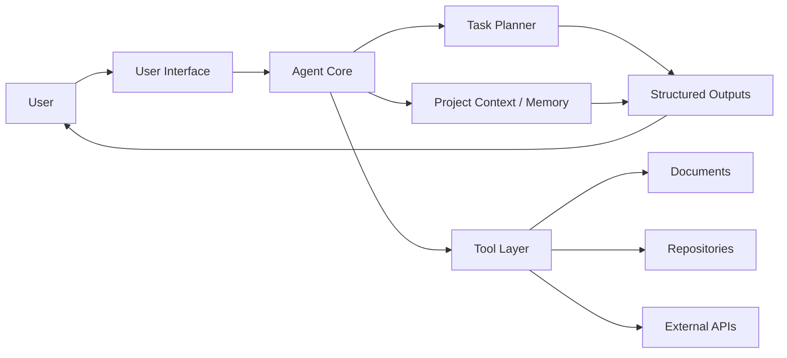

# AI Productivity Agent

A portfolio-ready AI assistant project focused on helping users turn open-ended work into organized, trackable, and repeatable productivity workflows.

> This repository is prepared for AI internship applications. Implementation details, screenshots, and deployment links should be updated as the project code and demos are added.

## Project Overview

AI Productivity Agent is designed as an AI-assisted workflow companion that can help a user break down tasks, organize context, draft structured outputs, and maintain a clearer execution loop. The project emphasizes practical agent design: clear inputs, transparent intermediate artifacts, useful defaults, and documentation that makes the system easy to understand.

## Motivation

Many AI tools are strong at generating one-off answers, but real productivity work often requires structure: gathering context, decomposing objectives, producing artifacts, and tracking what still needs to be done. This project explores how an AI agent can support that process in a professional, reliable, and user-centered way.

## Features

- Task decomposition for open-ended productivity requests
- Structured project documentation and artifact organization
- Reusable workflow patterns for planning, drafting, and review
- Architecture documentation for future implementation work
- Screenshot-ready documentation layout for demos and internship review

## Architecture

The current architecture is documented as a Mermaid diagram in [`docs/architecture.mmd`](docs/architecture.mmd).



## Screenshots

Add demo screenshots to [`docs/screenshots`](docs/screenshots).

Suggested screenshots:

- Main workflow screen
- Task decomposition output
- Generated document or repository artifact
- Example completed workflow

## Tech Stack

Update this section with the actual technologies used in the implementation.

- Language: TODO
- AI / LLM provider: TODO
- Backend framework: TODO
- Frontend framework: TODO
- Storage / memory layer: TODO
- Testing: TODO

## Future Roadmap

- Add a working prototype with a simple user interface
- Add examples for common productivity workflows
- Add evaluation cases for task decomposition quality
- Add persistent project memory
- Add integration tests for agent workflows
- Add deployment instructions and demo media

## Repository Structure

```text
AI-Productivity-Agent/
├── docs/
│   ├── architecture.mmd
│   └── screenshots/
├── .gitignore
├── LICENSE
└── README.md
```

## License

This project is licensed under the MIT License. See [`LICENSE`](LICENSE) for details.
