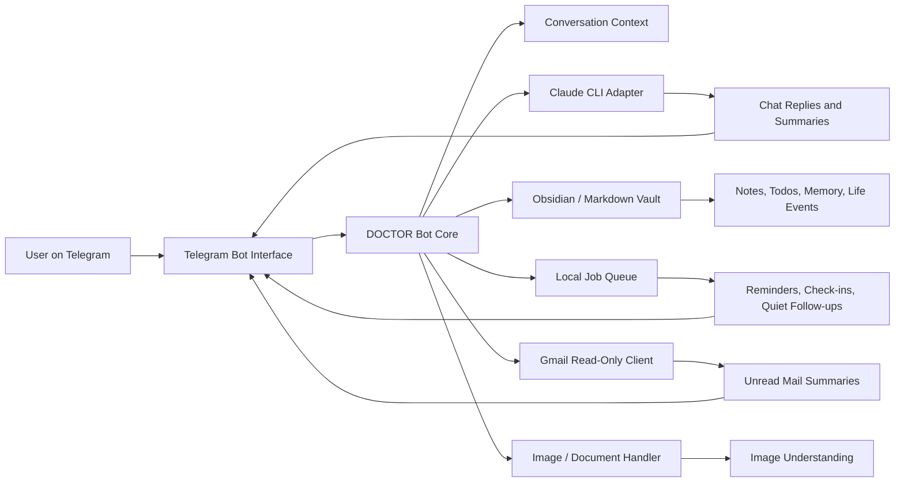

# DOCTOR

[](https://github.com/Tyouclwannie/AI-Productivity-Agent/actions/workflows/ci.yml)
[](https://www.python.org/)
[](LICENSE)

DOCTOR is a local-first AI productivity companion delivered through Telegram. It combines conversational assistance, an Obsidian-compatible Markdown memory, deterministic reminders, read-only Gmail summaries, image understanding, and proactive check-ins in one inspectable Python application.

The project is both a runnable reference implementation and an AI engineering portfolio project. It focuses on a practical question: how can a personal agent remember useful context and act later without turning every future action into an unverifiable model promise?

## Highlights

- **Telegram interface** for conversational and command-based workflows
- **Claude CLI bridge** for chat, grounded note answers, web-enabled prompts, and image interpretation
- **Local Markdown memory** that remains readable and editable in Obsidian
- **Persistent reminders** with one-time and daily schedules restored after restart
- **Quiet-until follow-ups** that pair interruption suppression with a deterministic wake-up job
- **Proactive safety gates** for opt-in state, quiet windows, idle time, cooldown, pending input, and repetition
- **Read-only Gmail summaries** using the `gmail.readonly` OAuth scope
- **Interrupt-aware conversation batching** when a user sends additional context while a reply is being generated
- **Synthetic tests and CI** that exercise parsing and local state without contacting external services

## Why it is different from a basic chatbot

DOCTOR separates language-model reasoning from actions that require reliability.

- The model can interpret a request, but Python code parses and registers reminders.
- A model response alone never proves that a reminder exists; scheduler state is persisted and restored.
- Proactive messages are considered only after deterministic local gates pass.
- Personal context stays in local Markdown and small local state files.
- Gmail access is read-only, and credentials are excluded from version control.

## Architecture



The standalone Mermaid source is available in [`docs/architecture.mmd`](docs/architecture.mmd).

## Core workflows

### Conversational assistant

Normal messages are buffered briefly so rapid follow-ups can be handled together. DOCTOR keeps a short local history, generates a response through Claude CLI, records useful context, and can regenerate a draft when the user interrupts with new information.

### Note-grounded answers

The `/ask` command collects Markdown from the configured vault and instructs the model to answer from those notes. This keeps retrieval inspectable: the source of truth is a folder of ordinary files, not an opaque hosted memory.

### Reminders and quiet periods

Natural-language reminders are parsed locally, persisted as JSON state, registered with the job queue, and restored on startup. Quiet-until requests also register a one-shot follow-up, so “do not interrupt me until later” does not silently become “never contact me again.”

### Proactive support

Check-ins and memory-driven sparks are opt-in. Local code checks quiet state, recent activity, cooldown, pending input, and repetition risk before asking the model whether a message is useful.

### Gmail summary

The optional Gmail integration reads unread message metadata from the previous 14 days and asks the model for a compact priority summary. It cannot modify, send, archive, or delete mail.

See [`docs/demo.md`](docs/demo.md) for sanitized synthetic examples.

## Quick start

### Requirements

- Python 3.11+
- A Telegram bot token
- Claude Code installed and authenticated
- A local directory for the Markdown vault

### Install and run

```bash
git clone https://github.com/Tyouclwannie/AI-Productivity-Agent.git
cd AI-Productivity-Agent
python3 -m venv .venv
source .venv/bin/activate
python -m pip install -r requirements.txt
cp .env.example .env
```

Set `TELEGRAM_BOT_TOKEN` and an absolute `VAULT_DIR` in `.env`, then run:

```bash
./run.sh
```

The application intentionally fails closed when `VAULT_DIR` is missing instead of writing personal notes into the project directory.

For Claude authentication, optional Gmail OAuth, local personality files, and verification steps, read the complete [setup guide](docs/setup.md).

## Commands

| Command | Purpose |
|---|---|
| `/ask <question>` | Answer from local Markdown notes |
| `/word <word>` | Save a generated vocabulary card |
| `/done [keyword]` | View or complete open todos |
| `/remind <time> <text>` | Create a one-time or daily reminder |
| `/gmail` | Summarize unread Gmail messages |
| `/gmail_on`, `/gmail_off` | Toggle proactive Gmail checks |
| `/checkin_on`, `/checkin_off` | Toggle proactive check-ins and sparks |
| `/remember <text>`, `/memory` | Update or view editable memory |
| `/profile`, `/profile_add <text>` | View or update local user profile context |
| `/life` | Summarize recent locally recorded life events |
| `/familiarity` | Show the current relationship/familiarity state |
| `/reset_context` | Clear short conversation history |

Plain Telegram messages are handled as normal conversation and may be classified into todos, learning notes, experiment notes, or general inbox entries.

## Configuration

All runtime settings are documented in [`.env.example`](.env.example). The most important values are:

| Variable | Required | Description |
|---|---:|---|
| `TELEGRAM_BOT_TOKEN` | Yes | Telegram bot credential |
| `VAULT_DIR` | Yes | Absolute path to the local Markdown vault |
| `CHAT_ID` | No | Destination for scheduled messages before a chat ID is learned |
| `CLAUDE_BIN` | No | Claude CLI executable; defaults to `claude` |
| `CLAUDE_MODEL` | No | Default lightweight model |
| `VOICE_MODEL` | No | Model used for conversational, web, and image paths |

DOCTOR also reads optional `persona.md`, `memory.md`, and `user_profile.md` files from `~/.config/doctor/`. Safe starter templates are provided under [`config/`](config/).

## Repository structure

```text
AI-Productivity-Agent/
├── .github/workflows/ci.yml
├── config/                    # Safe templates for local personality files
├── docs/
│   ├── architecture.mmd
│   ├── demo.md
│   ├── setup.md
│   └── screenshots/           # Reserved for reviewed, redacted media
├── scripts/daily_push.py      # Optional scheduled todo digest
├── tests/                     # Local parsing and persistence tests
├── bot.py                     # Telegram handlers, scheduler, proactive gates
├── gmail_client.py            # Read-only Gmail OAuth client
├── llm.py                     # Claude CLI subprocess adapter
├── prompts.py                 # Prompt construction and local personality loading
├── vault.py                   # Markdown storage and todo/life-event helpers
├── .env.example
├── requirements.txt
└── run.sh
```

## Testing

```bash
python -m pip install -r requirements-dev.txt
python -m compileall -q bot.py gmail_client.py llm.py prompts.py vault.py scripts
python -m pytest
```

CI runs the compile and test checks on Python 3.11 and 3.13. Automated tests do not contact Telegram, Gmail, or Claude and do not require credentials.

## Privacy and security

DOCTOR is designed for a single-user local environment. The following must never be committed:

- `.env`, Telegram tokens, or chat IDs
- Google OAuth `credentials.json` or `token.json`
- chat history, reminder/check-in state, or downloaded Telegram media
- customized files under `~/.config/doctor/`
- private Obsidian vault content
- screenshots containing real conversations, email addresses, or personal schedules

The repository includes defensive ignore rules, but staged changes should still be inspected before every commit. See [`SECURITY.md`](SECURITY.md) for the full boundary.

## Current limitations

- The application assumes one local user and one running polling instance.
- Natural-language time parsing focuses on common Chinese and Japanese expressions rather than a general calendar grammar.
- External integrations require the host machine to remain awake, online, and authenticated.
- Automated tests cover local logic; end-to-end Telegram, Claude, and Gmail checks require private credentials and must be run manually.
- The default vault taxonomy and prompt language are opinionated for a Chinese/Japanese personal workflow.

## Roadmap

- Add opt-in structured logging with automatic redaction
- Add a first-run configuration validator and health-check command
- Expand reminder parser fixtures across time zones and daylight-saving transitions
- Add dependency and secret scanning to CI
- Add reviewed screenshots or a short demo video using synthetic data
- Package the bot as a managed local service for macOS and Linux

## Contributing

Contributions should preserve deterministic scheduling, local privacy boundaries, and read-only Gmail access. See [`CONTRIBUTING.md`](CONTRIBUTING.md).

## License

This project is licensed under the [MIT License](LICENSE).
