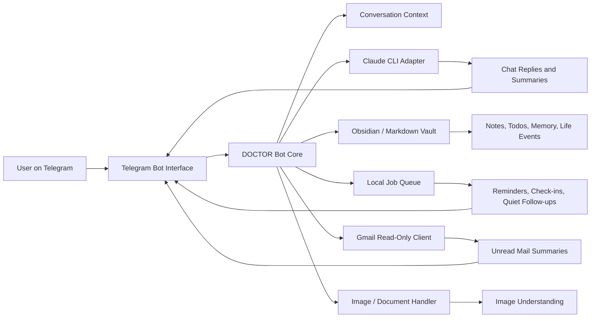

# DOCTOR

DOCTOR is a personal AI productivity companion built as a Telegram bot. It combines conversational assistance, Obsidian-compatible memory, reminders, Gmail unread-message summaries, and proactive check-ins into one lightweight local automation system.

This repository presents DOCTOR as an AI internship portfolio project. The documentation focuses on system design, agent behavior, safety boundaries, and practical user workflows without exposing private credentials, chat history, or personal vault content.

## Project Overview

DOCTOR is designed for day-to-day personal productivity rather than one-off chatbot replies. The bot receives messages through Telegram, keeps short conversational context, writes useful events into a Markdown vault, answers questions from local notes, and schedules follow-up actions through a local job queue.

The project explores how an AI agent can move beyond simple request-response interaction into persistent support:

- remembering useful context across conversations
- converting natural-language requests into reminders or todos
- summarizing unread Gmail messages with a read-only OAuth scope
- checking in proactively while respecting quiet periods
- keeping human-readable notes in an Obsidian-compatible vault

## Motivation

Many productivity assistants are either too manual or too opaque. DOCTOR was built to test a more personal and inspectable pattern: a small local agent that can chat naturally, keep useful records, and act later through deterministic scheduled jobs.

The core design goal is reliability. For future actions such as reminders, DOCTOR does not rely only on a model promise. It stores reminder state, restores scheduled jobs at startup, and separates quiet periods from ordinary recurring calendar facts.

## Features

- **Telegram chat interface** for natural conversation and command-based workflows
- **Claude CLI integration** for conversational responses, note-based answers, web-enabled prompts, and image interpretation
- **Obsidian-compatible Markdown vault** for notes, todos, words, life events, and project context
- **Memory layer** with editable long-term memory and user profile files
- **Reminder system** supporting one-time reminders and daily recurring reminders
- **Quiet-until handling** that pauses proactive messages and schedules a follow-up when the quiet window ends
- **Proactive check-ins and memory-driven spark messages** with local skip gates for quiet state, cooldown, and recent context
- **Gmail unread summaries** using the Gmail API with read-only access
- **Image/document message handling** for Telegram media inputs
- **Todo extraction and completion helpers** for lightweight task tracking

## Architecture

The system is organized around a local Python Telegram bot, a job queue, a Claude CLI bridge, and a Markdown vault.



The standalone Mermaid source is available in [`docs/architecture.mmd`](docs/architecture.mmd).

## Core Workflows

### Conversational Assistant

Users can send normal Telegram messages. DOCTOR keeps recent context, generates a reply through the LLM layer, and records useful events into the vault when appropriate.

### Note-Based Question Answering

The `/ask` command collects Markdown notes from the configured vault and asks the model to answer only from those notes. This keeps personal knowledge retrieval inspectable and grounded in local files.

### Reminders and Follow-Ups

DOCTOR parses natural-language reminder requests, creates scheduled jobs, persists reminder state, and restores active reminders on startup. It also supports daily recurring reminders.

### Gmail Summary

The Gmail integration reads unread messages from the last 14 days and formats metadata such as sender, subject, date, and snippet for model-assisted summarization. The OAuth scope is read-only.

### Proactive Support

The bot can run check-ins and spark-style proactive messages. Local gates check quiet windows, cooldowns, recent user activity, and repetition risk before the LLM is asked whether to send a message.

## Commands

Representative commands include:

- `/ask` - answer a question from local Markdown notes
- `/word` - save a vocabulary item
- `/done` - view or complete open todos
- `/remind` - create one-time or daily reminders
- `/gmail` - summarize unread Gmail messages
- `/gmail_on` and `/gmail_off` - enable or disable proactive Gmail checks
- `/checkin_on` and `/checkin_off` - enable or disable proactive check-ins
- `/remember` and `/memory` - write and view editable memory
- `/profile` and `/profile_add` - view or update basic user profile context
- `/life` - review recent life-event notes
- `/reset_context` - clear recent conversational context

## Tech Stack

- **Language:** Python
- **Bot framework:** `python-telegram-bot` with job queue support
- **LLM interface:** Claude CLI subprocess adapter
- **Knowledge store:** Obsidian-compatible Markdown files
- **Email integration:** Gmail API with read-only OAuth scope
- **Google libraries:** `google-api-python-client`, `google-auth-oauthlib`, `google-auth-httplib2`
- **Configuration:** `.env` via `python-dotenv`
- **Japanese text dependency:** `fugashi`, `unidic-lite`

## Repository Structure

```text
AI-Productivity-Agent/
├── docs/
│   ├── architecture.mmd
│   └── screenshots/
├── .gitignore
├── LICENSE
└── README.md
```

The current portfolio repository contains documentation only. Runtime credentials, tokens, personal chat logs, and private vault data are intentionally excluded.

## Screenshots

Screenshots should be added to [`docs/screenshots`](docs/screenshots) after private information has been removed.

Suggested screenshots:

- Telegram command menu or help response
- Reminder creation and reminder trigger
- Obsidian Markdown note generated by the bot
- Gmail unread-summary output with sensitive fields redacted
- Example proactive check-in with private context removed

## Privacy and Safety

DOCTOR is designed around local-first personal automation. The following files should not be committed:

- `.env`
- `.chat_id`
- `.chat_history.json`
- `credentials.json`
- `token.json`
- local state files containing private activity or reminder data
- private Obsidian vault contents

The Gmail integration uses a read-only scope. Any screenshots or demos should be reviewed carefully before sharing.

## Future Roadmap

- Add a sanitized demo walkthrough
- Add redacted screenshots for the main Telegram workflows
- Add tests for reminder parsing, quiet-window parsing, and job restoration
- Add a safer onboarding guide for local setup
- Add configuration examples without secrets
- Add optional packaging for local deployment

## License

This project is licensed under the MIT License. See [`LICENSE`](LICENSE) for details.
